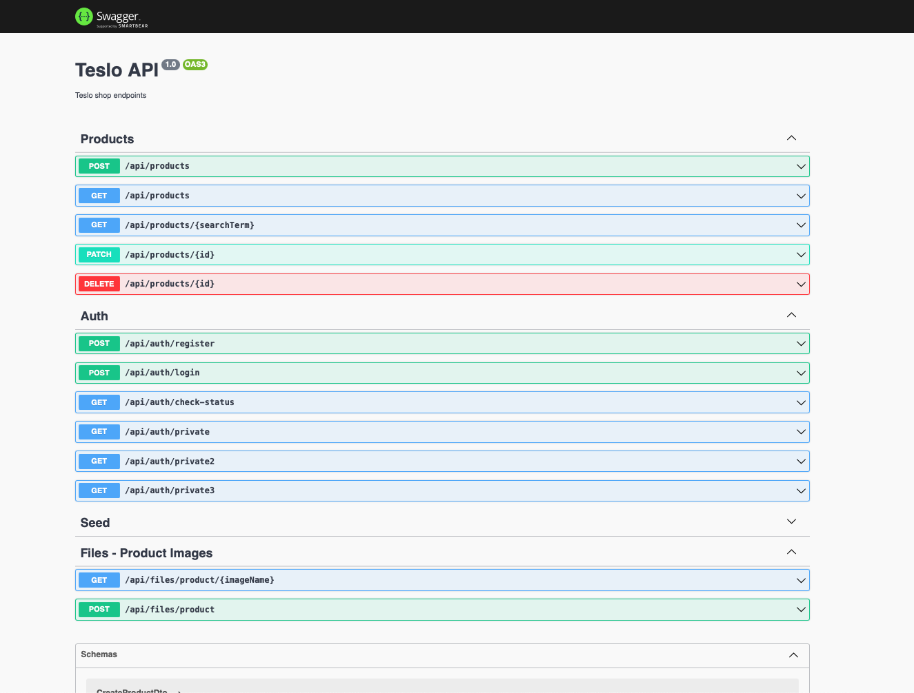

# Teslo API

This project is a simple API to manage a list of products and their prices and general data. It is a simple project to
learn NestJS and Typescript emulating a ecommerce.

## General Info

Built with NestJS, Typescript and PostgreSQL. Dockerized with different environments for development, testing and
production.

## Technologies

- Typescript
- NestJS
- PostgreSQL
- PgAdmin
- Docker

## Requirements

- [NodeJS](https://nodejs.org/en/download/)
- [Yarn](https://classic.yarnpkg.com/en/docs/install)
- [Docker](https://docs.docker.com/get-docker/)
- [Docker Compose](https://docs.docker.com/compose/install/)

## Setup

1. Clone the repository

2. Create a `dev.env` file with the same variables as `.env.example`

3. Up the database and backend with:

   ```sh
   yarn docker-compose:dev
   ```

4. Execute the seed to populate the database sending a `GET` request to: `http://localhost:3000/api/seed`

**Note:** If you want to use the database with PgAdmin, go to `http://localhost:5050` and introduce the credentials
assigned in the `.env` file in the `ADMIN_EMAIL` and `ADMIN_PASS` variables.

## Usage

### Endpoints

You can find the API documentation in `http://localhost:3000/api/`



## Deployment

You can see the project deployed in [Teslo API](https://teslo-shop.angelcruzl.dev/api/)

To deploy the project in production, you can use the following command:

```sh
   yarn docker-compose:prod
```

This will build the project and create the image for the backend without the database. To execute this command you need
to have the `prod.env` file with the same variables as `.env.example`.

After that, you can push the docker image to your docker registry and deploy it in your server.
